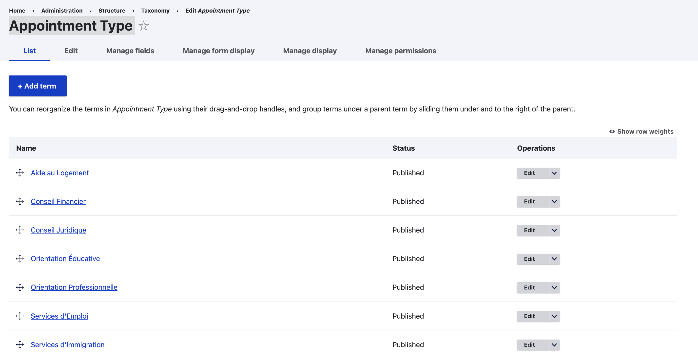
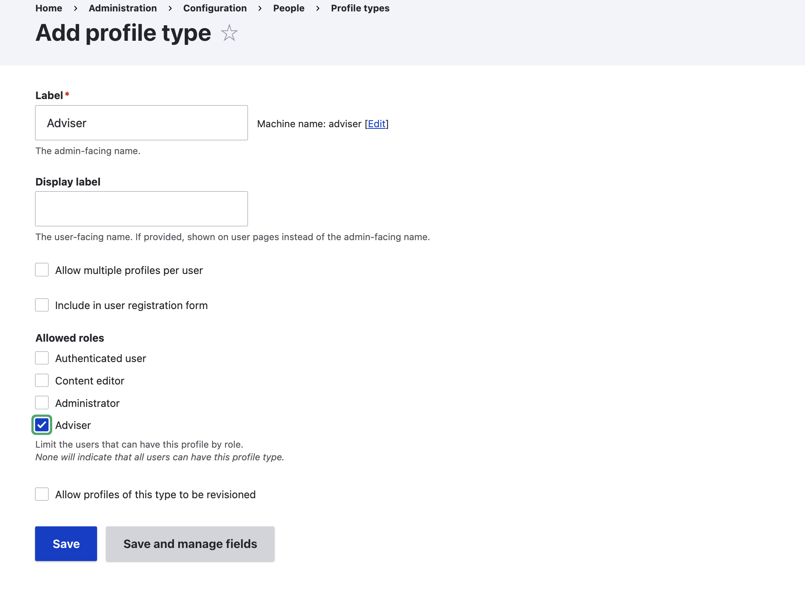
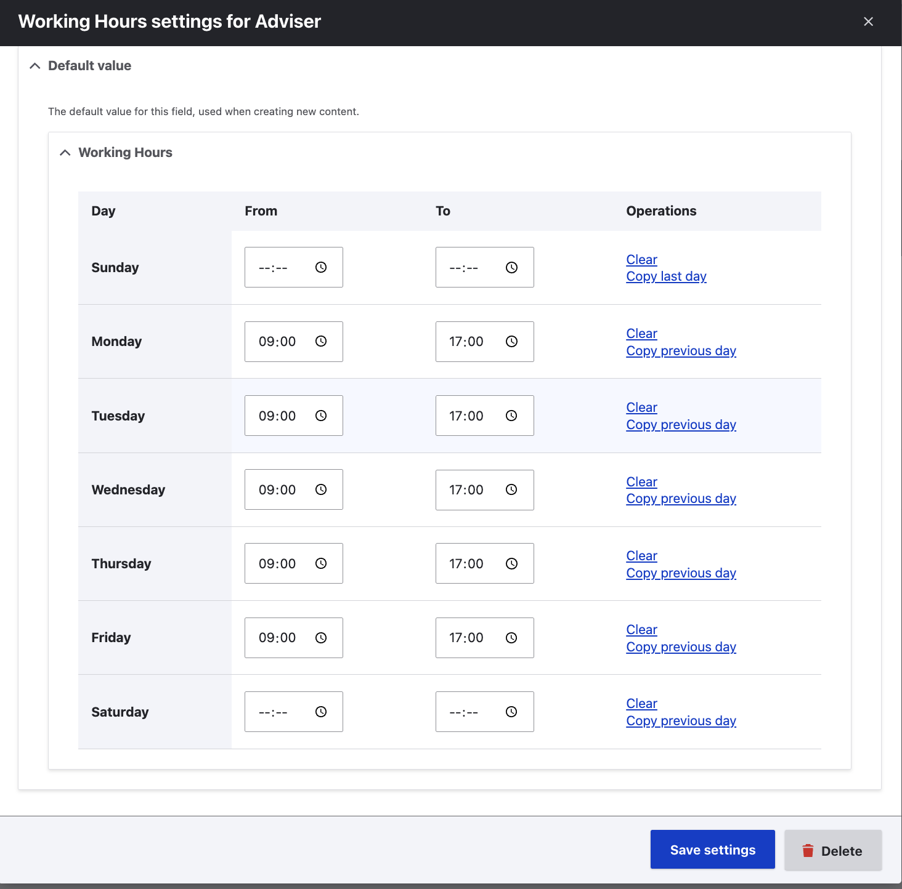

# Appointment Booking Module

## Overview
A Drupal 11 module that implements an appointment booking system,
allowing users to book appointments with advisers at agencies.

## Requirements
- Drupal 11
- Token module
- Pathauto module
- Profile module
- Office Hours module

## Installation
1. Enable the module: `drush en appointment -y`
2. Clear cache: `drush cr`

## Configuration

### 1. Taxonomy
Create the `appointment_type` vocabulary with your appointment types.

### 2. Adviser Role & Profile
The module ships with an `Adviser` role and profile type.
Only users with the Adviser role will have an Adviser profile.

### 3. Working Hours
Each adviser has default working hours Monday-Friday 09:00-17:00.
These can be changed per adviser in their profile.

### 4. Agencies
Create agencies at `/admin/structure/agency`

### 5. Advisers
Create adviser accounts at `/admin/people`
Assign the Adviser role and fill in their profile.

## Usage

### Booking an Appointment
Visit `/prendre-un-rendez-vous` and follow the 6 steps:
1. Pick an agency
2. Pick an appointment type
3. Pick an adviser
4. Pick a date and time
5. Enter personal information
6. Confirm

### Managing an Appointment
Visit `/mon-rendez-vous` and enter your phone number.

### Admin Interface
Visit `/admin/structure/appointment` to manage all appointments.

## Maintainers
