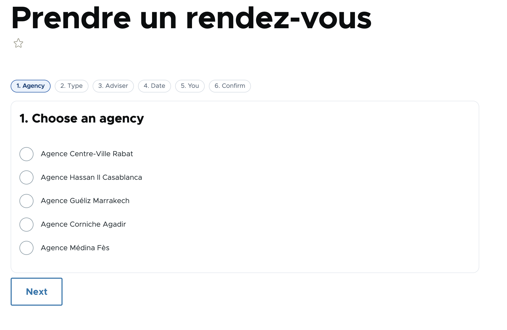
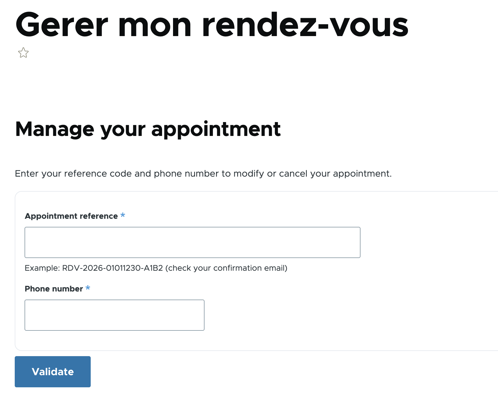
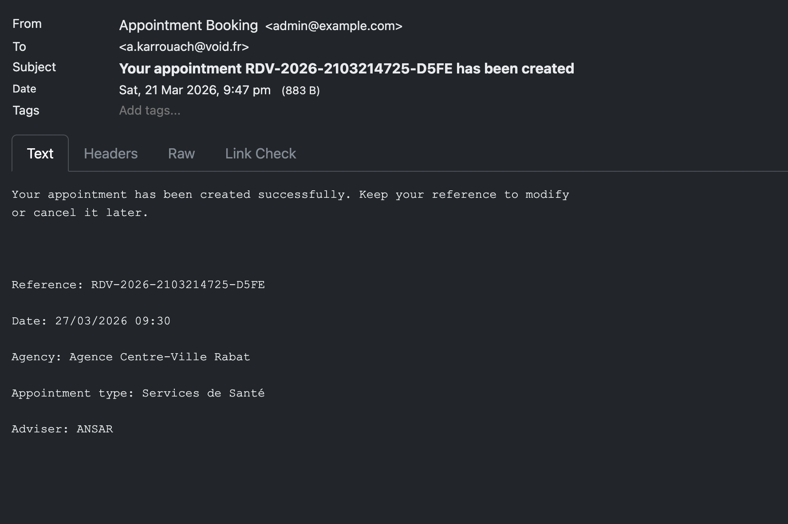
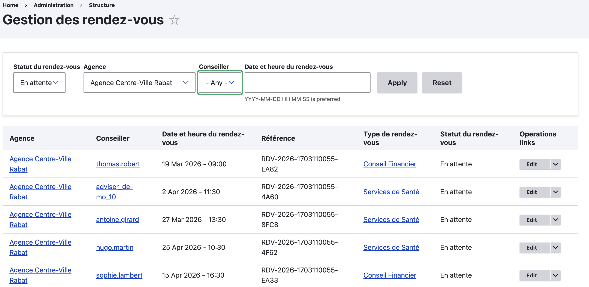

# Appointment Booking Module

A custom Drupal 11 module for booking appointments with advisers at agencies.

## Requirements

- Drupal 11
- [Profile](https://www.drupal.org/project/profile)
- [Office Hours](https://www.drupal.org/project/office_hours)
- [Token](https://www.drupal.org/project/token)
- [Pathauto](https://www.drupal.org/project/pathauto)
- [Better Exposed Filters](https://www.drupal.org/project/better_exposed_filters)
- [Views Data Export](https://www.drupal.org/project/views_data_export)

## Installation

```bash
composer require drupal/profile drupal/office_hours drupal/token drupal/pathauto drupal/better_exposed_filters drupal/views_data_export
drush en appointment -y
drush cr
```

## Uninstall

The module ships with an uninstall validator (`AppointmentUninstallValidator`) that automatically deletes all appointment and agency content before Drupal's content check runs. This means you can uninstall cleanly without manually removing content first.

```bash
drush pmu appointment -y
drush cr
```

On uninstall the module also cleans up:

- All `appointment` entities
- All `agency` entities
- Private tempstore data for `appointment_booking` and `appointment_management`
- Flood entries for `appointment.lookup`
- All module-owned configuration (roles, fields, profile type, taxonomy vocabulary)

## Reinstall

Because profile-related configs are placed in `config/optional`, the module can be reinstalled on any site regardless of whether the `profile` module was already installed beforehand. Configs that already exist are silently skipped rather than throwing a `PreExistingConfigException`.

```bash
drush pmu appointment -y
drush cr
drush en appointment -y
drush cr
```

## Update and Refresh

```bash
drush updb -y
drush cr
```

The module includes `appointment_update_9001()` to install missing entity tables if needed.

---

## Config Directory Structure

```
config/
├── install/     ← configs owned exclusively by this module (agency entity, field storage)
│   ├── core.entity_form_display.agency.agency.default.yml
│   ├── core.entity_view_display.agency.agency.default.yml
│   ├── field.field.agency.agency.field_operating_hours.yml
│   ├── field.storage.agency.field_operating_hours.yml
│   ├── system.action.agency_delete_action.yml
│   ├── system.action.agency_save_action.yml
│   ├── system.action.appointment_delete_action.yml
│   └── system.action.appointment_save_action.yml
└── optional/    ← configs that may already exist (profile fields, role, vocabulary)
    ├── core.entity_form_display.profile.adviser.default.yml
    ├── core.entity_view_display.profile.adviser.default.yml
    ├── field.field.profile.adviser.field_agency.yml
    ├── field.field.profile.adviser.field_specializations.yml
    ├── field.field.profile.adviser.field_working_hours.yml
    ├── field.storage.profile.field_agency.yml
    ├── field.storage.profile.field_specializations.yml
    ├── field.storage.profile.field_working_hours.yml
    ├── profile.type.adviser.yml
    ├── system.action.user_add_role_action.adviser.yml
    ├── system.action.user_remove_role_action.adviser.yml
    ├── taxonomy.vocabulary.appointment_type.yml
    ├── user.role.adviser.yml
    └── views.view.appointments_admin.yml
```

---

## Taxonomy — Appointment Type

Created a taxonomy vocabulary called `appointment_type` through the backoffice at `Structure → Taxonomy → Add Vocabulary`. This vocabulary serves two purposes: it categorises appointments by type, and it is used as the specializations field on the Adviser profile to match users with the right adviser during booking.

The vocabulary ships with the module via `config/optional/taxonomy.vocabulary.appointment_type.yml`. Terms are not shipped — they are created by the site administrator.


---

## Adviser Role

Created a custom role called `Adviser` at `People → Roles → Add Role`. This role is assigned to users who act as advisers in the system.

The role ships with the module via:

```
config/optional/user.role.adviser.yml
config/optional/system.action.user_add_role_action.adviser.yml
config/optional/system.action.user_remove_role_action.adviser.yml
```

---

## Adviser Profile

Installed the [Profile](https://www.drupal.org/project/profile) module and created a profile type called `Adviser` restricted to users with the `Adviser` role. This means only advisers will have this profile — not regular users or admins.

```bash
composer require drupal/profile
drush en profile -y
```

The profile type ships with the module via:

```
config/optional/profile.type.adviser.yml
```


### Specializations field

An entity reference field pointing to the `appointment_type` taxonomy with unlimited values. An adviser can cover multiple appointment types. When a user books an appointment, the system filters advisers by both agency and specialization to show only the relevant advisers.

### Agency field

An entity reference field pointing to the `agency` entity. Each adviser must be assigned to one agency. This field is required and is used by the booking wizard to filter advisers by the selected agency.

### Working Hours field

Powered by the [Office Hours](https://www.drupal.org/project/office_hours) module. Stores the adviser's weekly availability as a recurring pattern — not specific dates. The default value is Monday to Friday, 09:00 to 17:00.

```bash
composer require drupal/office_hours
drush en office_hours -y
```

At booking time, the system reads the adviser's working hours to generate available time slots, then subtracts any already booked appointments for that specific date to show only free slots.

```
Available slots = Working hours slots − Already booked appointments (status ≠ cancelled)
```


The field is stored in the database as integers:

```
profile__field_working_hours
entity_id | day | starthours | endhours
----------|-----|------------|----------
7         |  1  |    900     |   1700    ← Monday
7         |  2  |    900     |   1700    ← Tuesday
...
```

Day numbers follow PHP conventions: 0 = Sunday, 1 = Monday ... 6 = Saturday. Days with no rows are treated as closed.

---

## Agency Entity

Created a custom content entity called `Agency` with full CRUD pages.

Routes:

- `/admin/content/agency`
- `/agency/add`
- `/agency/{agency}`
- `/agency/{agency}/edit`
- `/agency/{agency}/delete`

Fields:

- Label
- Status
- Description
- Address
- Phone
- Email
- Operating hours (`field_operating_hours`)
- Specializations (`field_specializations`) — Entity reference to appointment_type taxonomy, accepts multiple values

### Specializations field

An entity reference field pointing to the `appointment_type` taxonomy with unlimited values. An agency can offer multiple types/specializations of appointments. This is used in the booking form to show only the relevant appointment types for the selected agency.

---

## Appointment Entity

Created a custom content entity called `Appointment` with full CRUD pages.

Routes:

- `/admin/content/appointment`
- `/rendez-vous/add`
- `/rendez-vous/{appointment}`
- `/rendez-vous/{appointment}/edit`
- `/rendez-vous/{appointment}/delete`

Fields:

- Label
- Status
- Description
- Appointment date and time
- Agency reference
- Adviser reference
- Appointment type reference
- Customer name
- Customer email
- Customer phone
- Appointment status (pending, confirmed, cancelled)
- Reference code
- Notes

Reference code is auto-generated in this format:

`RDV-YYYY-DDMMHHSS-XXXX`

---

## Public Booking Flow

### Step 1 — 6-Step Booking Wizard

The booking wizard is accessible at `/prendre-un-rendez-vous`. It guides the customer through 6 steps using AJAX to avoid full page reloads.



| Step           | Description                                                |
| -------------- | ---------------------------------------------------------- |
| 1. Agency      | Choose from all available agencies                         |
| 2. Type        | Choose appointment type filtered by agency specializations |
| 3. Adviser     | Choose adviser filtered by agency and specialization       |
| 4. Date & Time | Choose a date and available 30-minute slot                 |
| 5. Your info   | Enter name, email, phone and optional notes                |
| 6. Confirm     | Review all details and confirm                             |

On confirmation the system:

- Creates the appointment entity with status `pending`
- Auto-generates a unique reference code (`RDV-YYYY-DDMMHHSS-XXXX`)
- Sends a confirmation email to the customer
- Redirects to the appointment management page

**Double-booking prevention** — when a customer selects a date, the system queries all non-cancelled appointments for that adviser on that day and removes those time slots from the available options. Furthermore, the calendar prevents navigation to past dates and automatically blocks booking any time slots that have already passed on the current day.

### Calendar Integration (FullCalendar)

Step 4 of the booking wizard uses [FullCalendar v6](https://fullcalendar.io/) to display available and booked time slots interactively.

The library is loaded via CDN, declared in `appointment.libraries.yml`:

```yaml
fullcalendar:
  js:
    https://cdn.jsdelivr.net/npm/fullcalendar@6.1.11/index.global.min.js:
      type: external
      minified: true

booking_calendar:
  version: 1.x
  js:
    js/appointment-calendar.js: {}
  dependencies:
    - core/drupal
    - core/once
    - appointment/fullcalendar
```

The calendar is attached only on step 4:

```php
if ($step === 4) {
  $form['#attached']['library'][] = 'appointment/booking_calendar';
}
```

The calendar container is rendered with data attributes that the JavaScript reads to fetch slots:

```php
$container['calendar_wrapper'] = [
  '#type' => 'container',
  '#attributes' => [
    'id' => 'appointment-calendar',
    'data-adviser' => $adviser_id,
    'data-exclude-id' => 0,
  ],
];
```

#### Slots Endpoints

Available and booked slots are served by `AppointmentSlotsController` via two dedicated endpoints:

**1. Fetching Booked Slots:**
```
GET /appointment/booked-slots?adviser_id=5&start=2026-03-24&end=2026-03-31&exclude_id=0
```
This returns an array of visually blocked slots to the calendar:
```json
[
	{
		"start": "2026-03-24T10:00:00",
		"end": "2026-03-24T10:30:00",
		"allDay": false,
		"available": false,
        "type": "slot"
	}
]
```

**2. Checking a Specific Slot Validity (On Click):**
```
GET /appointment/check-slot?adviser_id=5&datetime=2026-03-24T09:00:00&exclude_id=0
```
Response format confirms if a slot is actually bookable:
```json
{
  "available": true
}
```

- `available: true` — slot is free, shown in blue as selected, clickable
- `available: false` — slot is outside working hours, in the past, or already booked, shown with an error message

When a customer clicks a valid slot, the hidden `appointment_date` field is populated with the ISO datetime value and passed to the form on the next step.

---

## Appointment Management

### Lookup by Reference and Phone

At `/gerer-rendez-vous`, customers enter their reference code and phone number to access their appointment.



The form includes:

- **Flood protection** — maximum 10 failed attempts per hour per IP address
- **Session-based verification** — once verified, the session is valid for 30 minutes
- Phone number normalisation — strips non-digit characters before comparing

### Modify Appointment

After verification, the customer can modify their appointment using the same 6-step wizard as the booking form. The existing appointment data is pre-filled. The current time slot is excluded from the double-booking check so the customer can keep the same slot.

### Cancel Appointment

The customer confirms cancellation with a checkbox. The system performs a soft cancel:

- Sets `appointment_status` to `cancelled`
- Sets the entity published status to `false` (unpublished)
- Sends a cancellation email
- Frees the time slot for other bookings

---

## Email Notifications

All email notifications are sent via `hook_mail()` in `appointment.module`. Emails are triggered for three events:



| Key         | Trigger                   | Subject                                     |
| ----------- | ------------------------- | ------------------------------------------- |
| `created`   | New appointment confirmed | Your appointment RDV-... has been created   |
| `modified`  | Appointment updated       | Your appointment RDV-... has been modified  |
| `cancelled` | Appointment cancelled     | Your appointment RDV-... has been cancelled |

Each email contains: reference code, date, agency, appointment type, and adviser name.

During development, emails are captured by [Mailpit](https://github.com/axllent/mailpit) which ships with DDEV at `https://<project>.ddev.site:8026`.

---

## Admin Interface

### Appointments Listing

The admin appointments listing is available at `/admin/structure/appointment`.



It is implemented as a Drupal View and ships with the module via:

```
config/optional/views.view.appointments_admin.yml
```

The view is automatically installed when the module is enabled on a fresh site.

#### Columns

| Column              | Description                                                   |
| ------------------- | ------------------------------------------------------------- |
| Référence           | Auto-generated reference code (e.g. RDV-2026-1703110055-EA82) |
| Agence              | Agency name, links to agency page                             |
| Conseiller          | Adviser username                                              |
| Date et heure       | Appointment date and time                                     |
| Type de rendez-vous | Appointment type, links to taxonomy term                      |
| Statut              | Current status in French (En attente, Confirmé, Annulé)       |
| Actions             | Edit and Delete operation links                               |

#### Exposed Filters

| Filter              | Type                   | Description                               |
| ------------------- | ---------------------- | ----------------------------------------- |
| Statut              | Select list            | Filter by En attente, Confirmé, or Annulé |
| Agence              | Select list            | Filter by agency name                     |
| Conseiller          | Select list            | Filter by adviser                         |
| Type de rendez-vous | Select list            | Filter by appointment type                |
| Date                | Date range (Min / Max) | Filter by date from and to                |

The filter dropdowns are powered by `hook_views_data_alter` in `appointment.module`
which registers the correct filter handlers for base fields — this is the standard
Drupal pattern for entities that define fields in code rather than through Field UI.

#### Access

The listing page requires the `administer appointment` permission.

---

### CSV Export

The CSV export is available at `/admin/structure/appointment/export`.

An **Exporter en CSV** button appears automatically on the listing page and
inherits whatever filters are currently active. Only the filtered results are exported.

The CSV file includes all appointment fields including customer details not shown
in the table:

| Column              | Description                   |
| ------------------- | ----------------------------- |
| Référence           | Auto-generated reference code |
| Agence              | Agency name                   |
| Conseiller          | Adviser name                  |
| Date et heure       | Appointment date and time     |
| Type de rendez-vous | Appointment type              |
| Statut              | Status in French              |
| Nom du client       | Customer full name            |
| Email               | Customer email address        |
| Téléphone           | Customer phone number         |
| Notes               | Appointment notes             |

The export uses the `views_data_export` module with no row limit, making it
safe for large datasets.

#### Access

The export page requires the `administer appointment` permission.

---

## Permissions

| Permission               | Description                                                       |
| ------------------------ | ----------------------------------------------------------------- |
| `administer appointment` | Full access: create, edit, delete, view admin listing, export CSV |
| `view appointment`       | View individual appointment pages                                 |
| `edit appointment`       | Edit existing appointments                                        |
| `delete appointment`     | Delete appointments                                               |
| `create appointment`     | Create new appointments                                           |

Assign permissions at `/admin/people/permissions`.

---

## Public Routes

| Path                           | Description                              |
| ------------------------------ | ---------------------------------------- |
| `/prendre-un-rendez-vous`      | 6-step booking wizard                    |
| `/gerer-rendez-vous`           | Lookup appointment by reference + phone  |
| `/gerer-rendez-vous/actions`   | Modify or cancel a verified appointment  |
| `/gerer-rendez-vous/modifier`  | Multi-step appointment modification form |
| `/gerer-rendez-vous/supprimer` | Appointment cancellation form            |
| `/appointment/booked-slots`    | JSON endpoint for rendering booked slots |
| `/appointment/check-slot`      | JSON endpoint for validating slot clicks |
